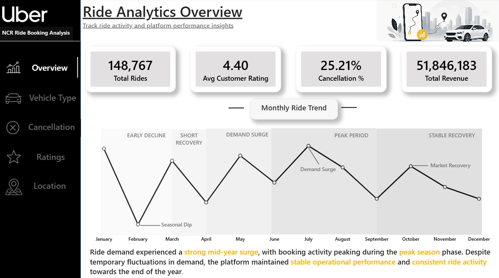

# 🚖 Uber NCR Ride Booking Analytics Dashboard

A complete end-to-end Business Intelligence project where raw **NCR Ride Booking** data was collected from **Kaggle**, cleaned and prepared in **Microsoft Excel**, analyzed using **SQL**, and transformed into an interactive **Power BI** dashboard using **DAX** and **Data Modeling**.

This project provides actionable business insights by analyzing ride bookings, revenue, cancellations, vehicle performance, customer behavior, and ratings to support data-driven business decisions.

---

## 📊 Dashboard Preview

---

## 🎯 Project Objectives

- Analyze overall ride booking performance.
- Track revenue and booking trends.
- Monitor customer and driver cancellations.
- Compare vehicle type performance.
- Analyze customer and driver ratings.
- Build an interactive dashboard for business reporting.

---

## 🛠️ Tools & Technologies Used

- **Microsoft Excel** (Data Cleaning & Preparation)
- **SQL** (Data Analysis)
- **Power BI**
- **Power Query**
- **DAX**
- **Data Modeling**

---

## 📂 Dataset

**Dataset:** Uber Data Analytics(ncr_ride_bookings.csv) 

**Source:** Kaggle

---

## 📌 Key KPIs

- Total Bookings
- Total Revenue
- Completed Rides
- Cancellation Rate
- Average Ride Value
- Average Driver Rating
- Average Customer Rating

---

## 📈 Dashboard Features

### Executive Overview
- Booking Summary
- Revenue Overview
- Completion Rate
- Cancellation Rate
- KPI Cards

### Vehicle Analysis
- Bookings by Vehicle Type
- Revenue by Vehicle Type
- Vehicle Performance Comparison

### Cancellation Analysis
- Customer Cancellations
- Driver Cancellations
- Cancellation Reasons

### Ratings Analysis
- Customer Ratings
- Driver Ratings
- Rating Distribution

---

## 🧹 Data Preparation

The dataset was cleaned and prepared using **Microsoft Excel** by:

- Removing duplicate records
- Handling missing values
- Correcting data types
- Standardizing values
- Preparing the dataset for SQL and Power BI analysis

---

## 💡 Business Insights

- Identified top-performing vehicle categories.
- Analyzed booking completion and cancellation patterns.
- Evaluated customer and driver satisfaction through ratings.
- Compared revenue across different vehicle types.
- Built interactive reports for dynamic business analysis.

---

## 🚀 Skills Demonstrated

- Data Cleaning
- SQL Querying
- Business Intelligence
- Power BI Dashboard Development
- DAX Calculations
- KPI Reporting
- Data Visualization
- Business Insight Generation

---

## 👨‍💻 Author

**Naveen Bemad**

Aspiring Data Analyst
